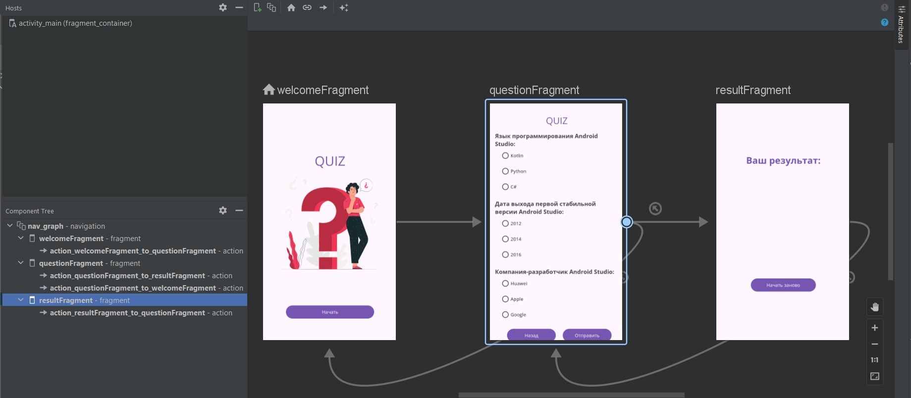

# Урок 7. Фрагменты

Цели практической работы
• Попрактиковаться в работе с фрагментами и библиотекой AndroidX Navigation.
• Потренироваться в проектировании навигации по приложению.
• Закрепить навыки работы с разметкой и стилями.

Что нужно сделать:

Скопируйте из прошлых модулей в новый проект наработки по приложению QUIZ и добавьте в него несколько экранов.
Для организации навигации по приложению обязательно используйте библиотеку AndroidX Navigation.
Приложение должно состоять из трёх фрагментов: экрана приветствия, экрана опроса и экрана результатов.

Порядок действий:
1. В папку, соответствующую этому модулю, скопируйте весь проект из папки предыдущего модуля «Ресурсы проекта».
2. Подключите к проекту библиотеку AndroidX Navigation и добавьте необходимые компоненты в разметку 
Activity по инструкции, приведённой ранее.
3. Добавьте в проект три экрана, создайте для них разметку и наполните их данными. Используйте стили, 
темы и ресурсы, которые получились по результатам прошлых модулей.
4. Экран приветствия должен содержать в себе минимальную информацию (собственно, приветствие), а также кнопку 
«Начать», которая должна переводить пользователя на следующий экран «Опрос».
5. Экран опроса должен представлять из себя опросник из трёх вопросов.
Разметку для этого экрана реализуйте с помощью компонента ScrollView, который позволяет пролистывать экран.
Добавьте в ScrollView необходимые View. Получите список вопросов и ответов и установите эти данные в соответствующие View.
При необходимости установите листенеры во View, чтобы иметь возможность обрабатывать ответы на вопросы. 
На этом экране также должны быть две кнопки:
— «Назад», которая возвращает приложение на стартовый экран.
— «Отправить», по нажатию на которую обрабатываются результаты опросника с помощью функции QuizStorage.answer(). 
Полученный результат нужно отправить в третий экран «Результаты» в качестве аргумента.
6. Экран Результаты на котором должны быть:
— Результат прохождения опросника, который вы передали в предыдущем пункте.
— Кнопка «Начать заново», которая открывает новый незаполненный экран с опросником.
7. Протестируйте ваше приложение. Убедитесь, что результаты опроса вычисляются и передаются на экран результатов.
8. Поработайте с бэкстеком фрагментов и настройте навигацию по проекту следующим образом:
— Экран приветствия, кнопка «Начать»: ведёт на экран опроса.
— Экран приветствия, кнопка Back вашего телефона: закрывает приложение.
— Экран опроса, кнопка «Назад»: возвращает на экран приветствия.
— Экран опроса, кнопка Back вашего телефона: также возвращает на экран приветствия.
— Экран опроса, кнопка «Отправить»: ведёт на экран результатов, передаются соответствующие результаты.
— Экран результатов, кнопка «Начать заново»: ведёт на новый экран опроса, при этом, если на открывшемся 
экране нажать кнопку Back вашего телефона, приложение не должно возвращаться на экран результатов. 
Вместо этого должен открываться экран приветствия.
— Экран 3, кнопка Back вашего телефона: возвращает на экран приветствия.

===========================================================================
## Демонстрация решения:

